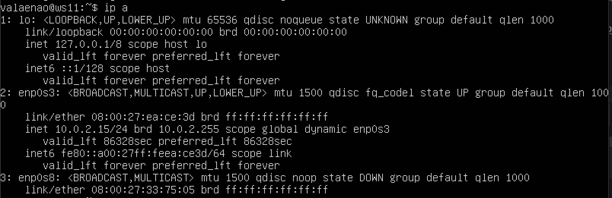
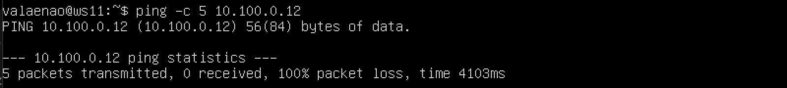
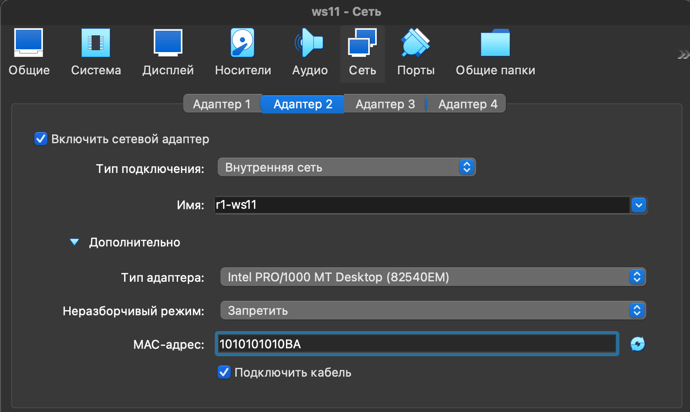
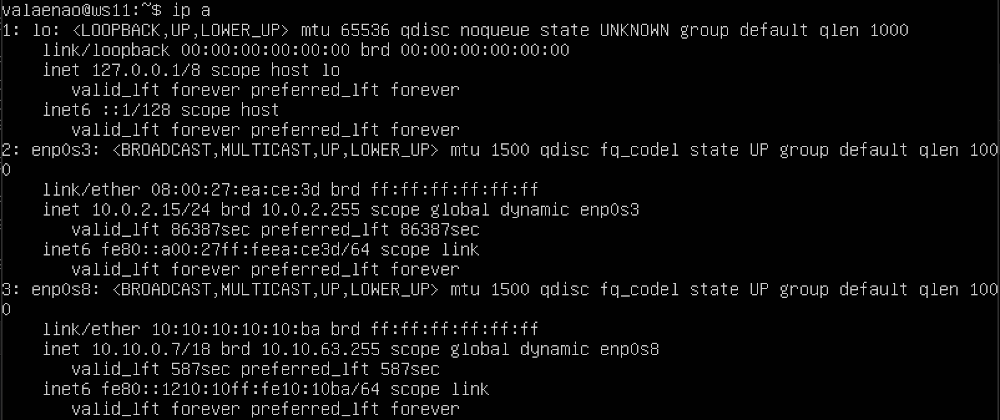
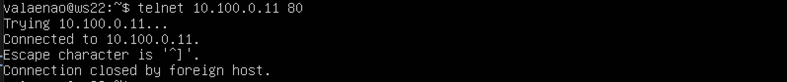

## Part 1. Инструмент **ipcalc**

#### 1.1 Сети и маски

* Для начала устанавливаем утилиту ipcalc через команду: `sudo apt install ipcalc`
Далее узнаём адрес сети: `ipcalc 192.167.38.54/13 | grep Network`

* Переводим маску *255.255.255.0* в префиксную и двоичную запись через команду: `ipcalc 255.255.255.0 | grep -e Adress: -e Netmask`

* */15* в обычную и двоичную: `ipcalc 0.0.0.0/15 | grep Netmask`

* *11111111.11111111.11111111.11110000* в обычную и префиксную: `ipcalc 0.0.0.0/28 | grep Netmask`

* Выводим минимальный и максимальный хост в сети *12.167.38.4* при масках: */8*, *11111111.11111111.00000000.00000000*, *255.255.254.0* и */4*.
`ipcalc 12.167.38.4/8 | grep -e HostMin -e HostMax`

`ipcalc 12.167.38.4/16 | grep -e HostMin -e HostMax`

`ipcalc 12.167.38.4 255.255.254.0 | grep -e HostMin -e HostMax`

`ipcalc 12.167.38.4/4 | grep -e HostMin -e HostMax`

### 1.2. localhost
Для определения возможности обращения к приложению, работающему на localhost, с указанных IP-адресов, необходимо понять, какие из них относятся к диапазону loopback адресов.
Диапазон loopback адресов определен как 127.0.0.0/8, что означает все адреса от 127.0.0.0 до 127.255.255.255 включительно.

1) 127.0.0.2 Этот IP-адрес входит в диапазон loopback адресов.  Обратиться к приложению на localhost через этот IP **получится**.

2) 127.1.0.1 Этот IP-адрес также входит в диапазон loopback адресов. Обратиться к приложению на localhost через этот IP **получится**.

3) 194.34.23.100 Этот IP-адрес не входит в диапазон loopback адресов (127.0.0.0/8). Поэтому обратиться к приложению на localhost через этот IP **не получится**.

4) 128.0.0.1 Этот IP-адрес не входит в диапазон loopback адресов (127.0.0.0/8). Поэтому обратиться к приложению на localhost через этот IP **не получится**.

### 1.3. Диапазоны и сегменты сетей

1) Какие из перечисленных IP можно использовать в качестве публичного, а какие только в качестве частных.

*Публичные IP-адреса* используются для идентификации устройств в глобальной сети интернет. Они должны быть уникальными и доступными для маршрутизации через интернет.

К ним относятся:

* 134.43.0.2
* 192.172.0.1
* 172.68.0.2
* 192.169.168.1
* 172.0.2.1

*Частные IP-адреса* предназначены для использования в локальных сетях (LAN) и не маршрутизируются напрямую через интернет. Они могут быть повторно использованы в различных локальных сетях.

К ним относятся:
* 10.0.0.45
* 192.168.4.2
* 172.20.250.4
* 172.16.255.255
* 10.10.10.10

2) Какие из перечисленных IP адресов шлюза возможны у сети 10.10.0.0/18.

- 10.10.0.2 
- 10.10.10.10
- 10.10.1.255

## Part 2. Статическая маршрутизация между двумя машинами
##### С помощью команды: `ip a` посмотрим существующие сетевые интерфейсы.
ip a (ws1, ws2)

В директории /etc/netplan находится файл 00-installer-config.yaml, его откроем в текством редакторе с помощью команды sudo nano /etc/netplan/00-installer-config.yaml.
  Внесли изменения в строке dhcp4: false
  Добавили строку:
адреса и маску: ws1 - 192.168.100.10, маска /16

Тоже самое сделали со второй машиной, только установили другой адрес и маску:
ws2 - 172.24.116.8, маска /12.

Вводим команду: `sudo netplan apply` для применения конфигурации

### 2.1. Добавление статического маршрута вручную

Добавляем статический маршрут от одной машины до другой и обратно при помощи команды вида: `ip r add`

Далее пропингуем соединение между машинами.

### 2.2. Добавление статического маршрута с сохранением
Создадим две виртуальные машины с двумя адаптерами:
* NAT (опционально)
* Внутреняя сеть

Адаптер c NAT необходим для связи с терминалом по ssh протоколом>
Задаем следующие адреса и маски: ws1 - 192.168.100.10/16, ws2 - 172.24.116.8/12

epn0s8 - доступ к локально сети

Далее пропингуем соединение между машинами.

## Part 3. Утилита iperf3

### 3.1. Скорость соединения
8 Mbps - 1MB/s
100 MB/s - 800000 Kbps
1 Gbps - 1000 Mbps

### 3.2. Утилита iperf3
Для начала устанавливаем утилиту ipcalc через команду: `sudo apt install iperf3`
Запускаем на ws1 сервер с адресом 192.168.100.10 с помощью команды `iperf3 -s`

Подключаемся к вышеупомнянотому серверу на ws2 с помощью команды `iperf3 -с 192.168.100.10`
  

## Part 4. Сетевой экран

### 4.1. Утилита iptables
Создаем файлы `sudo nano /etc/firewall.sh`

**iptables -F** - очищает все правила в таблице фильтрации (Filter table) iptables. Это означает, что все текущие настройки брандмауэра будут удалены, и трафик будет разрешен по умолчанию.

**iptables -X** - удаляет все пользовательские цепочки правил из таблицы фильтрации. Цепочки - это наборы правил, которые определяют, как обрабатывать определенные типы трафика.

**iptables -A INPUT -p tcp --dport 22/80 -j ACCEPT** - добавляет правило в цепочку INPUT (цепочка входящего трафика) таблицы фильтрации. Правило разрешает входящий TCP-трафик на порт 22 (SSH) или 80 (HTTP) и направляет его на цель ACCEPT, что означает разрешение трафика на этих портах.

**iptables -A OUTPUT -p icmp --icmp-type echo-request -j ASSEPT** - команда разрешает отправку ICMP-запросов на эхо (ping) с устройства.

**iptables -A OUTPUT -p icmp --icmp-type echo-request -j DROP** - команда блокирует все исходящие ICMP-запросы на эхо (ping) с устройства.

Запускаем файлы на обеих машинах командами: `chmod +x /etc/firewall.sh` и `/etc/firewall.sh`
c помощью: `iptables -L` увидим как выполняются правила

- Опишем разницу между стратегиями, применёнными в первом и втором файлах :

  При обработке правил сверху-вниз при совпадении условий, первым применяется то правило, которое раположено выше.
1) На ws1 запрещающее правило стоит перед разрешающим, значит имеет приотритет и ws1 не может пропинговать виртуальную машину.
  
2) В ws2 наоборот т.к разрешающее правило находится перед запрещающим.

### 4.2. Утилита nmap
Командой `ping` найдем машину, которая не «пингуется».

утилитой `nmap` покажем, что хост машины запущен.

## Part 5. Статическая маршрутизация сети

### 5.1. Настройка адресов машин
Сначала создаём одну виртуальную машину. Потом нажимаем правую клавишу мыши на вновь созданной машине, вибираем Клонировать и клонируем ещё 4 машины с соответствующими заданию именами (ws11, ws21, ws22 и r1, r2).
Запускаем машины и меняем на них имя хоста на соотвтетствующее.
Создаём для каждой машины адаптеры и соединяем их друг с другом в соответствии со схемой в задании

Проверяем какие интерфейсы есть на машине r1. И подобным образом можно проверить все остальные машины. На машинах ws их будет на 1 меньше.

 * r1

* ws11

Далее настроим конфигурации машин. Открываем файл через: `sudo nano etc/netplan/00-installer-config.yaml`

С помощью команды: ` sudo nano etc/netplan/00-installer-config.yaml` прописываем настройки для машин, согласно схемы сети.

Перезапускаем сервис сети. Так как у нас ошибок нет, мы запускаем `ip -4 a` для проверки, что адрес машин задан верно.

Далее нам нужно пропинговать ws22 с ws21 с помощью команды: `ping -c 5 10.20.0.10`

Так же пингуем r1 с ws11: `ping -c 5 10.10.0.2`

### 5.2. Включение переадресации IP-адресов
Для включения переадресации IP, выполняем команду на роутерах: `sudo sysctl -w net.ipv4.ip_forward=1`
Однако, при  таком подходе переадресация не будет работать после перезагрузки системы

Чтобы это исправить мы открываем файл: `sudo nano /etc/sysctl.conf` и добавляем в него следующую строку:
`net.ipv4.ip_forward = 1`
При использовании этого подхода, IP-переадресация включена на постоянной основе.

### 5.3. Установка маршрута по-умолчанию
Настраиваем маршрут по-умолчанию (шлюз) для рабочих станций. Для этого добавляем *gateway4: ip* роутера в файле конфигураций etc/netplan/00-installer-config.yaml через команду: `sudo nano etc/netplan/00-installer-config.yaml`

После изменения настроек применяем команду для вступления в силу изменений: `sudo netpan apply`
Вызовем *ip r*, чтобы показать, что маршрут добавился в таблицу маршрутизации

Пропингуем с ws11 роутер r2, пинг не пройдёт, т.к. роутер "не знает" куда вернуть ответ, при этом передача пакетов с машины осуществляется.

Запускаем на r2 утилиту **tcpdump**, она позволяет прослушать порты и вывести на экран информацию с каких IP адресов приходят пакеты. В данном случае слушаем интерфейс enp0s8:
`tcpdump -tn -i enp0s8`
Сначала на экране r2 будет пусто, идёт ожидание входящих пакетов
Запускаем ping на ws11:
`ping -c 5 10.100.0.12`

На экране должно **r2** должно появиться

### 5.4. Добавление статических маршрутов

* Добавляем в роутеры r1 и r2 статические маршруты в файле конфигураций.
  Для этого мы открываем файлы конфигураций сети: `sudo nano /etc/netplan/00-installer-config.yaml` и меняем для каждого роутера.

Перезапускаем сервис сети: `sudo netplan apply`

С помощью: `ip r` проверяем настройки на роутерах

- 10.20.0.0/26 через 10.100.0.12 устройство enp0s9

- 10.10.0.0/18 через 10.100.0.11 устройство enp0s8
- 

Запускаем команды на ws 11 `ip r list 10.10.0.0/[маска сети]` и `ip r list 0.0.0.0/0`

Для адреса 10.10.0.0/[маска сети] был выбран маршрут, отличный от 0.0.0.0/0 т.к маршрут по умолчанию 0.0.0.0/0 соответствует любому адресу, в то время как маршрут 10.10.0.0/18 указывает на конкретную подсеть с более точным определением адресов, что делает его более специфичным и предпочтительным для маршрутизации.

### 5.5. Построение списка маршрутизаторов

Запускаем на r1 команду дампа:
`tcpdump -tnv -i enp0s8`

-n - не конвертировать адреса в имена;

-t - не выводить время при выводе каждой строкчи дампа;

-v - при синтаксическом анализе и выводить более подробную информацию. Например, печатаются время создания, общая длина и параметры IP-пакета. Также включает дополнительные проверки целостности пакетов, такие как проверка контрольной суммы заголовка IP и ICMP.

При помощи утилиты **traceroute** построим список маршрутизаторов на пути от ws11 до ws21.

Основные этапы работы traceroute
1) Отправка пакетов:
Traceroute отправляет серию пакетов к целевому узлу, используя протоколы UDP, ICMP или TCP в зависимости от операционной системы. В Windows по умолчанию используется ICMP, а в Linux и macOS — UDP.
2) Установка TTL (Time to Live):
Каждый пакет имеет поле TTL, которое указывает максимальное количество маршрутизаторов (хопов), через которые пакет может пройти. Начальное значение TTL обычно устанавливается на 1. Это означает, что пакет может пройти только один маршрутизатор.
3) Получение ответов от маршрутизаторов:
Когда пакет достигает маршрутизатора, TTL уменьшается на 1. Если TTL достигает 0, маршрутизатор отбрасывает пакет и отправляет обратно сообщение об ошибке (ICMP Time Exceeded). Traceroute фиксирует IP-адрес маршрутизатора и время, затраченное на передачу пакета.
4) Увеличение TTL и повторение процесса:
После получения ответа от первого маршрутизатора, traceroute увеличивает TTL на 1 и отправляет новый пакет. Этот процесс повторяется до тех пор, пока пакет не достигнет целевого узла или не будет достигнуто максимальное количество хопов (обычно 30).
5) Вывод результатов:
В результате выполнения команды traceroute отображается список всех маршрутизаторов, через которые прошли пакеты, вместе с временем задержки для каждого хопа. Это позволяет пользователям видеть, где могут возникать задержки или проблемы в сети

### 5.6. Использование протокола ICMP при маршрутизации

Запускаем на r1 перехват сетевого трафика, проходящего через enp0s8 с помощью команды:
`tcpdump -n -i enp0s8 icmp`

Теперь пропингуем с ws11 несуществующий IP (например, 10.30.0.111) с помощью команды:
`ping -c 1 10.30.0.111`

## Part 6. Динамическая настройка IP с помощью DHCP
Устанавливаем DHCP с помощью команды: `sudo apt-get install isc-dhcp-server`, обновляем пакеты:`sudo apt update`
Далее открываем: `sudo nano /etc/dhcp/dhcpd.conf` 

### 1) У казываем адрес маршрутизатора по-умолчанию, DNS-сервер и адрес внутренней сети.

### 2) Открываем файл: `sudo nano /etc/resolv.conf` (содержит адреса серверов имен, к которым имеет доступ данная система)

И  прописываем: `nameserver 8.8.8.8`

Перезагружаем службу DHCP командой: `systemctl restart isc-dhcp-server`

Машину ws21 перезагружаем при помощи: `sudo reboot` и через `ip a` показываем, что она получила адрес `10.20.0.10/26`. 

Пингуем ws22 с ws21

Указывем MAC адрес у ws11, для этого в `etc/netplan/00-installer-config.yaml` добавляем строки: macaddress: `10:10:10:10:10:BA`, `dhcp4: true`

Для r1 проделаем аналогичную настройку но с выдачей адресов с жесткой привязкой к MAC-адресу (ws11).
Укажем адрес маршрутизатора по-умолчанию, DNS-сервер и адрес внутренней сети.

`sudo apt-get install isc-dhcp-server`

`sudo nano /etc/dhcp/dhcpd.conf`

Открываем файл: `sudo nano /etc/resolv.conf` (содержит адреса серверов имен, к которым имеет доступ данная система)

И  прописываем: `nameserver 8.8.8.8`

Перезагружаем службу DHCP командой: `systemctl restart isc-dhcp-server`

Проводим аналогичные тесты - машину ws11 перезагружаем при помощи: `sudo reboot` и через `ip a` смотрим какой адрес назначен машине

Пингуем ws22 с ws11

### Запросим с ws21 обновление ip адреса.

Используем команду: `dhclient enp0s8 -r` чтобы освободить адресс. Затем команду: `dhclient enp0s8` чтобы назначить новый. Проверим результат с помощью: `ip a`

В части 6 были использованы следующие опции DHCP протокола:

`dhclient enp0s8 -r` чтобы освободить адресс. 
`dhclient enp0s8` чтобы назначить новый. Проверим результат с помощью: `ip a`

## Part 7. NAT

### 1 В файле /etc/apache2/ports.conf на ws22 и r1 изменим строку `Listen 80` на `Listen 0.0.0.0:80`, то есть сделаем сервер Apache2 общедоступным.

Далее запускаем веб-сервер Apache командой: `service apache2 start` на ws22 и r1.

### 2 Создаем фаервол на r2 (как в части 4). Следующие правила:
1) Удаление правил в таблице filter - iptables -F
2) Удаление правил в таблице "NAT" - iptables -F -t nat
3) Отбрасывать все маршрутизируемые пакеты - iptables --policy FORWARD DROP

Создаем файл `sudo nano /etc/firewall.sh`

Запускаем файл командами: `chmod +x /etc/firewall.sh` и `/etc/firewall.sh`

Проверяем соединение между ws22 и r1 командой: `ping`

4) Разрешить маршрутизацию всех пакетов протокола ICMP, для этого прописываем правило для протокола icmp и цепочки FORWARD

`sudo nano /etc/firewall.sh`

Запускаем файл командами: `chmod +x /etc/firewall.sh` и `/etc/firewall.sh`

Теперь при запуске файла firewall.sh с этими правилами, ws22 должна "пинговаться" с r1

Проверяем соединение между r1 и ws22

Добавляем в файл ещё два правила:

5) Включаем SNAT, а именно маскирование всех локальных ip из локальной сети, находящейся за r2 (по обозначениям из Части 5 - сеть 10.20.0.0)

6) Включаем DNAT на 8080 порт машины r2 и добавим к веб-серверу Apache, запущенному на ws22, доступ извне сети

Запускаем файл командами: `chmod +x /etc/firewall.sh` и `/etc/firewall.sh`

Проверяем соединение по TCP для SNAT, подключаемся к серверу Apache командой `telnet [адрес] [порт]`

## Part 8. Дополнительно. Знакомство с SSH Tunnels
Запускаем веб-сервер Apache на ws22 только на localhost (то есть в файле /etc/apache2/ports.conf меняем строку `Listen 80` на `Listen localhost:80`).

Установливаем  openssh-server через команду:
`sudo apt install openssh-servers`

Используем Local TCP forwarding с ws21 до ws22, чтобы получить доступ к веб-серверу на ws22 с ws21.

`ws21: ssh -L 8080:localhost:80 10.20.0.20`

Для проверки, сработало ли подключение в обоих предыдущих пунктах, перейдим во второй терминал (например, клавишами Alt + F2) и выполняем команду `telnet 127.0.0.1 [локальный порт]`

Тоже самое делаем с ws11 ws22,
используя  Remote TCP forwarding:
`ws11: ssh -R 8888:10.20.0.20:80 kossadda@10.20.0.20`

Для проверки, сработало ли подключение в обоих предыдущих пунктах, переходим во второй терминал (например, клавишами Alt + F2) и выполняем команду `telnet 127.0.0.1 [локальный порт]` 

